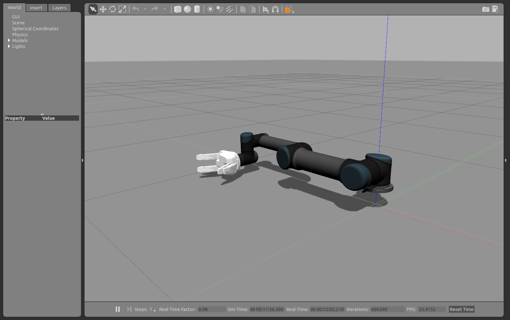

# Haptic Teleoperation in RAIN hub project
---
## Overview
This is a repository of visual/haptic-teleoperated industrial robotic manipulators in RAIN hub project (https://rainhub.org.uk/). 
At the moment, this source file is a gazebo model for UR5 and Robotiq 3-finger gripper. 

** Author/Maintainer: Inmo Jang (inmo.jang@manchester.ac.uk), Robotics for Extreme Environment Group, University of Manchester**

## Version Information
Version 1.1 uses effort_controllers for joint control of UR5. (Ver 1.0 uses position_controllers). 
This update enables the gazebo model to pick and grasp an object in the gazebo environment. In Ver 1.0, this was not the case. 
Instead, it becomes necessary to set PID gains, which were just set by trial and errors in this version. 

---
## Installation

### Environment setting

- Install ROS as in http://wiki.ros.org/kinetic/Installation/Ubuntu
- Install Gazebo ROS pakcage as in http://gazebosim.org/tutorials?tut=ros_installing (Instruction for ROS Kinetic)

### Building from Source

#### Dependencies
The dependencies required are as follows: 

(1) Universal robot package (https://bitbucket.org/rain_epsrc/universal_robot/)

(2) Robotiq 3-finger gripper package (https://bitbucket.org/rain_epsrc/robotiq)

Note: Some of the dependencies are originally from other repositories (please refer to each repo's git), but modified for this project. 

### Packages Overview

This repository consists of following packages:

* ***rain*** the meta-package for the teleoperation system meta package
* ***rain_description*** contains the urdf description of the integrated robot (UR5 + the gripper).
* ***rain_gazebo*** contains the launch file for the gazebo simulator.

---
## Usage A: Use the Gazebo Model Only

Launch the Gazebo simulator:

        roslaunch rain_gazebo ur5_robotiq.launch

#### Control the arm

##### Via LEAP Motion

Execute below to see the sensed information in RViz:

        roslaunch leap_motion demo.launch
        
Then, execute

        rosrun ur_driver gazebo_teleop_leap.py
        
        

##### Via Keyboard Teleoperation

Execute below in the command line to control each joint using a keyboard: 

        rosrun ur_driver gazebo_teleop_key.py

Or you may control the position/orientation of the end effector by:

        rosrun ur_driver gazebo_teleop_key_xyz.py
        

#### Control the gripper

##### Via Keyboard Teleoperation

To control the gripper, in another terminal, excute below in the command line:
        
        rosrun robotiq_s_model_control SModelController_gazebo.py

The gripper has Basic/Pinch/Wide/Scissor modes, and the fingers can also be individually controlled. 

##### Via ***rostopic pub*** 

Closing the hand halfway:

        rostopic pub --once right_hand/command robotiq_s_model_control/SModel_robot_output {1,0,1,0,0,0,127,255,0,155,0,0,255,0,0,0,0,0,0}

Fully open the hand:

        rostopic pub --once right_hand/command robotiq_s_model_control/SModel_robot_output {1,0,1,0,0,0,0,255,0,155,0,0,255,0,0,0,0,0,0}

Change the grasping mode to pinch and close the gripper:

        rostopic pub --once right_hand/command robotiq_s_model_control/SModel_robot_output {1,1,1,0,0,0,255,255,0,155,0,0,255,0,0,0,0,0,0}

Switch to wide mode and fully open the hand:

        rostopic pub --once right_hand/command robotiq_s_model_control/SModel_robot_output {1,2,1,0,0,0,0,255,0,155,0,0,255,0,0,0,0,0,0}

Change to scissor mode and close the fingers:

        rostopic pub --once right_hand/command robotiq_s_model_control/SModel_robot_output {1,3,1,0,0,0,255,255,0,155,0,0,255,0,0,0,0,0,0}

Open fingers:

        rostopic pub --once right_hand/command robotiq_s_model_control/SModel_robot_output {1,3,1,0,0,0,0,255,0,155,0,0,255,0,0,0,0,0,0}

--- 
## Usage B: Use the Gazebo Model while intefacing with Unity via Rosbridge

In the ROS side, launch the Gazebo simulator:

        roslaunch rain_unity ur5_robotiq_unity.launch

In the Unity side, run the scene (*Scene_181109.unity*) with rosbridge. 

In the ROS side again, launch one of the following controller nodes:

- Mode 0 Control Node

        rosrun ur_driver gazebo_teleop_leap_mode0_vr.py

- Mode 1 Control Node

        rosrun ur_driver gazebo_teleop_leap_mode1_vr.py

- Gripper Control Mode (Only being activated in Mode 1)

        rosrun robotiq_s_model_control SModelController_gazebo_vr.py

Result is : https://www.youtube.com/watch?v=TQSg8v2cMcE

--- 
## Usage C: Use the real robot

#### Network Setting and Initialisation
Assuming that a UR5 and a Robotiq 3-finger gripper are connected via Ethernet as:

- UR5: 172.22.22.2
- Gripper: 192.168.1.2
        
For setting up the network connection, please refer to

- UR5: https://github.com/qian256/ur5_setup
- Robotiq Gripper: http://wiki.ros.org/robotiq/Tutorials/Control%20of%20an%20S-Model%20Gripper%20using%20the%20Modbus%20TCP%20Protocol

        
(1) Bring up the UR5(which uses v3.X):

- Ping test before bringing up: 

        ping 172.22.22.2
        
- Bringing up:

        roslaunch ur_modern_driver ur5_bringup.launch robot_ip:=172.22.22.2

- Topic test after bringing up:

        rostopic echo /joint_states
        
        
(2) Bring up the Gripper:
        
- Ping test before bringing up:

        ping 192.168.1.2
        
- Bringing up:

        rosrun robotiq_s_model_control SModelTcpNode.py 192.168.1.11

- Topic test after bringing up:

        rostopic echo /SModelRobotInput
        

#### Control the arm

##### Via LEAP Motion

Execute below to see the sensed information in RViz:

        roslaunch leap_motion demo.launch
        
Then, execute

        rosrun ur_driver ur5_teleop_leap.py
        
        
##### Via Keyboard Teleoperation

You may control the position/orientation of the end effector by:

        rosrun ur_driver ur5_teleop_key_xyz.py
        
##### Via Joystick

Please refer to https://bitbucket.org/inmojang/jog_arm/src/master/README.md

        

#### Control the gripper

##### Via Keyboard Teleoperation

To control the gripper, in another terminal, excute below in the command line:
        
        rosrun robotiq_s_model_control SModelController.py
  
--- 
## Usage C-2: Intefacing with Unity via Rosbridge

After setting up the network connection as described in C-1, then, launch the following launch file in the ROS side:

        roslaunch rain_unity ur5_robotiq_unity_real.launch

In the Unity side, run the scene (*Scene_181109.unity*) with rosbridge. And, we need to deactivate some publishers/subscribers of "Rosconnecter", otherwise overflow errors come up. 
In the ROS side, 

In the ROS side again, launch one of the following controller nodes:

- Mode 0 Control Node

        rosrun ur_driver ur5_teleop_leap_mode0_vr.py

- Mode 1 Control Node (under development)

        

- Gripper Control Mode (Only being activated in Mode 1)

        rosrun robotiq_s_model_control SModelController_vr.py  